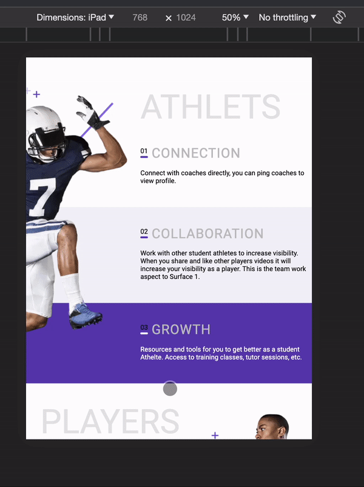

### Tripetch Assignment Frontend Figma

- https://www.figma.com/file/Fu4S5oafdEHbF1c3RZGqcm/frontend-responsive?node-id=0%3A1&mode=dev

---

### Project Description

As requirement to create one single page with responsive display using any framework.

I've choose **NextJs** to create this project and using **Tailwind** to styling our project
since this have a nice project structure and i design to apply scalable project structure in this even if it only create one single page.

```
.
├── public
│ └── assets
│
├── src
│ ├── app (next js routing system)
│ ├── components (next js routing system)
│ ├── contexts (reusable contexts)
│ ├── hooks (reusable hooks)
│ └── views (encapsulate feature views)
|       └── app (app route feature)
|           ├── Main.tsx
|           ├── components
|           └── helper
│
│
├── tailwind.config.ts
└── tsconfig.json
```

---

### How to run this project

1. using node version 20.0 above
2. run `npm install`
3. run `npm run dev`

---

### Screen Short

1. Desktop Screen


---

2. Table Screen



---

3. Mobile Screen


